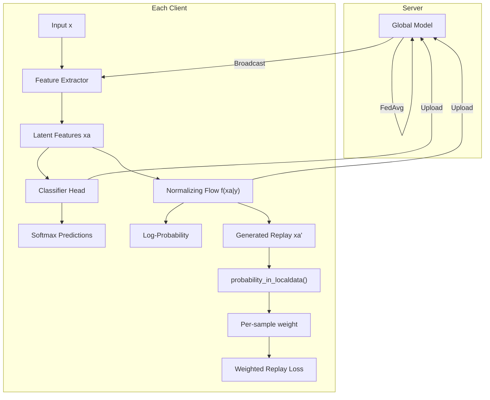
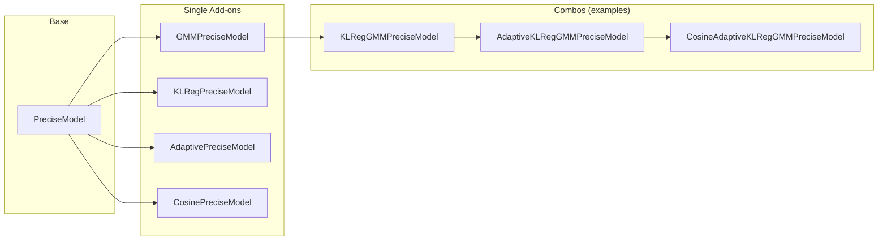
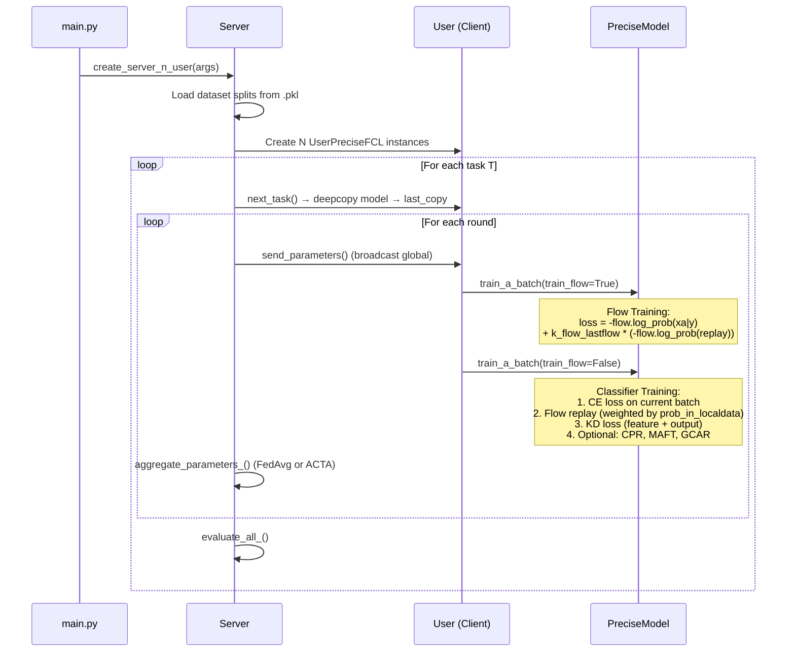
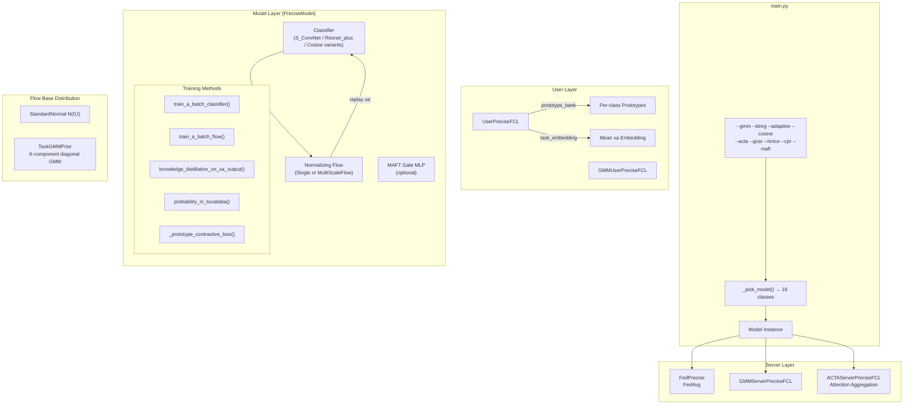

# AF-FCL1: Architecture Deep-Dive & Baseline Comparison

## 1. Baseline Paper: "Accurate Forgetting for Heterogeneous FCL" (ICLR 2024)

**Authors:** Wuerkaixi et al.  
**Venue:** ICLR 2024  
**Code:** [github.com/zaocan666/AF-FCL](https://github.com/zaocan666/AF-FCL)

### 1.1 Problem Statement

Standard Federated Continual Learning (FCL) methods try to **retain all past knowledge** to prevent catastrophic forgetting. The paper argues this is harmful when clients have **heterogeneous or antagonistic data** — retaining biased features from other clients degrades performance.

### 1.2 Core Idea: "Accurate Forgetting"

> **Not all past knowledge is worth keeping.** Selectively forget biased/irrelevant features while retaining valuable ones.

The mechanism uses a **Normalizing Flow (NF)** model to estimate feature credibility via probability density. Features with low probability under the local data distribution are down-weighted during replay — this is the "accurate forgetting."

### 1.3 Baseline Architecture (Paper)



**Key baseline components:**

| Component | Role |
|---|---|
| **Feature Extractor** | CNN (`S_ConvNet`) or ResNet-18-CBAM (`Resnet_plus`) producing 512-d `xa` |
| **Classifier** | `fc1 → fc2 → fc_classifier` with softmax |
| **Normalizing Flow** | 4-layer affine coupling transform with `StandardNormal` base distribution, class-conditioned via one-hot `y` |
| **Accurate Forgetting** | `probability_in_localdata()` — Gaussian density estimation per class on flow-generated replay features; low-probability samples get down-weighted |
| **Knowledge Distillation** | Feature-level MSE + output-level cross-entropy KD from both `last_classifier` and `global_classifier` |
| **Flow Replay** | `sample_from_flow(last_flow)` generates past-task features; flow trained with NLL on both current data and replay from `last_flow` |
| **Server Aggregation** | Vanilla **FedAvg** (weighted by sample count) |
| **Exploration** | `flow_explore_theta` controls the explore-forget trade-off via `k_loss_flow_explore_forget = (1-θ)·prob_mean + θ` |

### 1.4 Baseline Training Loop (Per Round)

```
For each task T:
  For each round in task T:
    Server broadcasts global model → all clients
    Each client:
      1. Train Flow: NLL on current xa + replay from last_flow
      2. Train Classifier:
         a. Cross-entropy on current batch
         b. Generate replay from flow, weight by probability_in_localdata()
         c. KD loss (feature + output) from last_classifier + global_classifier
         d. Backward + clip gradients
    Server: FedAvg aggregation
```

---

## 2. Your Project Architecture (AF-FCL1)

### 2.1 File Structure

```
AF-FCL1/
├── main.py                          # Entry point, flag-based model selection
├── ResNet.py                        # ResNet-18 with CBAM attention
├── FLAlgorithms/
│   ├── PreciseFCLNet/
│   │   ├── classify_net.py          # S_ConvNet, Resnet_plus
│   │   └── model.py                 # PreciseModel (baseline + GCAR/HMCE/CPR/MAFT)
│   ├── servers/
│   │   ├── serverbase.py            # Server base class
│   │   └── serverPreciseFCL.py      # FedPrecise server (FedAvg)
│   ├── users/
│   │   ├── userbase.py              # User base class
│   │   └── userPreciseFCL.py        # UserPreciseFCL (prototype bank, task embedding)
│   ├── GMMModule/                   # GMM prior for NF base distribution
│   │   ├── gmm_prior.py             # TaskGMMPrior (nflows Distribution)
│   │   ├── gmm_model.py             # GMMPreciseModel
│   │   ├── gmm_server.py            # GMMServerPreciseFCL
│   │   └── gmm_user.py              # GMMUserPreciseFCL
│   ├── KLRegModule/                 # Flow stabilisation
│   │   ├── klreg_mixin.py           # KLRegMixin (grad clip + Jacobian KL)
│   │   └── klreg_models.py          # KLRegPreciseModel, KLRegGMMPreciseModel
│   ├── AdaptiveModule/              # Dynamic KD weighting
│   │   ├── adaptive_mixin.py        # AdaptiveMixin (sigmoid scaling)
│   │   └── adaptive_models.py       # All adaptive model combinations
│   ├── CosineModule/                # Cosine classifier head
│   │   ├── cosine_head.py           # CosineLinear layer
│   │   ├── cosine_classifier.py     # S_ConvNetCosine, ResnetPlusCosine
│   │   └── cosine_model.py          # All cosine model combinations
│   └── ACTAModule/                  # Attention-based server aggregation
│       └── acta_server.py           # ACTAServerPreciseFCL
├── nflows/                          # Normalizing flow library (vendored)
├── utils/
│   ├── dataset.py                   # Dataset loading & split parsing
│   ├── model_utils.py               # Model creation helpers
│   ├── meter.py                     # Training metrics tracker
│   └── utils.py                     # Seed, logging utilities
└── datasets/                        # Data & split files
```

### 2.2 Model Composition System

Your project uses a **mixin-based composition** pattern. The `_pick_model()` function in `main.py` selects from **16 model classes** based on 4 boolean flags:



**MRO (Method Resolution Order) example:**

`CosineAdaptiveKLRegGMMPreciseModel`:
- `__init__` → CosineMixin (swaps head) → AdaptiveMixin → KLRegMixin stashes attributes → GMMPreciseModel (installs GMM prior) → PreciseModel (builds everything)
- `train_a_batch_classifier` → AdaptiveMixin → PreciseModel
- `train_a_batch_flow` → KLRegMixin (grad clip + Jacobian KL)
- `knowledge_distillation_on_xa_output` → AdaptiveMixin (alpha scaling) → PreciseModel
- `fit_gmm_prior` → GMMPreciseModel

### 2.3 Data Flow (Detailed)



---

## 3. Detailed Comparison: Baseline Paper vs. Your Implementation

### 3.1 Summary Table

| Aspect | Baseline Paper (AF-FCL) | Your Implementation (AF-FCL1) | Status |
|---|---|---|---|
| **Core Algorithm** | Normalizing flow + accurate forgetting | ✅ Same | Preserved |
| **Feature Extractor** | S_ConvNet / ResNet-18 | ✅ Same (S_ConvNet + ResNet-18-CBAM) | Preserved |
| **Flow Architecture** | 4-layer affine coupling, StandardNormal base | ✅ Same + HMCE multi-branch option | Extended |
| **Accurate Forgetting** | `probability_in_localdata()` | ✅ Same + log-space computation for numerical stability | Improved |
| **KD Loss** | Feature MSE + Output CE from last + global | ✅ Same + AdaptiveMixin scaling | Extended |
| **Server Aggregation** | FedAvg (sample-weighted) | ✅ Same + ACTA attention-weighted option | Extended |
| **Flow Base Distribution** | StandardNormal N(0,I) | ✅ Same + GMM prior option | Extended |
| **Flow Training** | No gradient clipping on flow | Added clip_grad_norm_ + optional Jacobian KL reg | **Bug Fix + Extension** |
| **Classifier Head** | nn.Linear | ✅ Same + CosineLinear option | Extended |
| **Replay Weighting** | Fixed `k_loss_flow` | ✅ Same + MAFT learnable gate | Extended |
| **Gradient Handling** | Combined backward | ✅ Same + GCAR conflict-aware projection | Extended |
| **Prototype Memory** | None | Added CPR contrastive prototype replay | **New** |
| **NaN Handling** | None | Comprehensive NaN/Inf guards everywhere | **Robustness** |
| **Datasets** | EMNIST, MNIST-SVHN-FASHION, CIFAR-100 | ✅ Same + EMNIST-shuffle variants | Extended |
| **CIFAR-100 backbone** | ResNet-18-CBAM | ✅ Same `Resnet_plus` | Preserved |

### 3.2 What's Identical to the Baseline

These core mechanisms are **unchanged** from the original paper/code:

1. **The "Accurate Forgetting" mechanism** — `probability_in_localdata()` computes per-class Gaussian density of flow-generated replay features against the current task's feature statistics. Low-probability (biased) features get low weight in the replay CE loss.

2. **Flow architecture** — 4-layer affine coupling transforms with `ResidualNet` conditioner, `ReversePermutation` for first half and `RandomPermutation` for second half.

3. **Training decomposition** — Flow and classifier are trained in alternating phases within each local epoch (flow first, classifier second).

4. **KD structure** — Four KD components: feature-last, output-last, feature-global, output-global, with separate weighting coefficients.

5. **FedAvg aggregation** — Sample-count-weighted parameter averaging.

6. **Task transition** — `next_task()` deepcopies the full model into `last_copy` before loading new task data.

### 3.3 Your Novel Extensions (9 Modules)

#### A. GMM Prior (`--gmm`)

**What baseline does:** Uses `StandardNormal N(0,I)` as the flow's base distribution for all tasks.

**What you changed:** Replace with `TaskGMMPrior` — a K-component diagonal-covariance GMM fitted on latent codes at each task boundary.

**Why it matters:** After task T, the GMM captures the multi-modal cluster structure of T's latent space. When task T+1 trains the flow, the loss `−log p_GMM(z) − log|det J|` forces new features into the same cluster geometry, preventing semantic drift.

**Key implementation detail:** The GMM is fitted via scikit-learn on CPU (`GaussianMixture` with `covariance_type='diag'`), then the parameters are stored as PyTorch buffers for differentiable `log_prob` during training.

---

#### B. KLReg Flow Stabilisation (`--klreg`)

**What baseline does:** No gradient clipping on flow optimizer (classifier has `max_norm=1.0`). This causes **flow-loss explosion** from ~round 6 onward.

**What you added:**
1. **NaN/Inf guard on `loss_last_flow`** (baseline only guards `loss_data`)
2. **`clip_grad_norm_` on flow parameters** — confirmed root cause fix
3. **Optional Jacobian KL regularisation** (`--klreg_beta > 0`): Hutchinson-estimator approximation of `||J||_F² − log|det J|` pushes the coupling Jacobian toward orthogonal-like behaviour

> [!IMPORTANT]
> This is both a **bug fix** (missing gradient clipping) and an **extension** (Jacobian KL). The baseline flow training was fundamentally unstable for longer runs.

---

#### C. Adaptive KD Weighting (`--adaptive`)

**What baseline does:** Fixed KD weight coefficients `k_kd_feature` and `k_kd_output` for all batches.

**What you added:** Scale all KD components by `α = sigmoid(batch_acc − 0.5)`:
- Low batch accuracy (struggling) → α ≈ 0.38 → relax KD, let model learn
- High accuracy → α ≈ 0.62 → tighten KD regularisation

**Implementation:** Overrides `knowledge_distillation_on_xa_output()` via `AdaptiveMixin` — zero extra forward passes (uses existing `softmax_output`).

---

#### D. Cosine Classifier Head (`--cosine`)

**What baseline does:** Standard `nn.Linear` for classification.

**What you added:** `CosineLinear` head: `ŷ = σ · (x/||x||) · (W/||W||)` with learnable temperature σ.

**Why it helps CL:** Removes magnitude bias — new-task classes can't dominate by having larger weight norms. Forces the model to learn directional (geometric) class separation.

**Implementation:** `CosineMixin` swaps `fc_classifier` in-place after `PreciseModel.__init__`, rebuilds optimizers to include the new parameters. σ is federated via FedAvg automatically.

---

#### E. ACTA Server Aggregation (`--acta`)

**What baseline does:** FedAvg with sample-count weighting.

**What you added:** Attention-weighted aggregation based on task embeddings:
1. Each client computes a task embedding (mean of `xa` over current task data)
2. Server computes cosine similarity between each client embedding and a global prototype
3. Softmax with temperature τ produces attention weights
4. Parameters aggregated with attention weights instead of sample counts

---

#### F. GCAR: Gradient Conflict-Aware Replay (`--gcar`)

**What baseline does:** Replay loss and current loss are combined and backpropagated together.

**What you added:** Separate gradient computation for current-task and replay losses. When gradients conflict (negative dot product), the replay gradient is **projected away** from the current gradient direction before combining with a sigmoid-scaled β coefficient.

---

#### G. HMCE: Multi-Scale Flow (`--hmce`)

**What baseline does:** Single normalizing flow.

**What you added:** `MultiScaleFlow` wrapper — multiple flow branches with different feature permutations (identity, reverse, random). Learnable scale logits determine branch weighting. Log-prob uses log-sum-exp over all branches.

---

#### H. CPR: Contrastive Prototype Replay (`--cpr`)

**What baseline does:** No prototype memory.

**What you added:** Per-user prototype bank storing EMA-updated class prototypes. Contrastive loss (`_prototype_contrastive_loss`) compares current/replay features against stored prototypes using temperature-scaled cosine similarity + cross-entropy.

---

#### I. MAFT: Meta-Learned Forgetting Threshold (`--maft`)

**What baseline does:** Fixed replay scaling.

**What you added:** Learnable MLP gate (`3 → hidden → 1 → sigmoid`) that takes `[batch_acc, flow_prob_mean, flow_explore_theta]` as input and outputs a `[0,1]` scale factor for the replay loss. The gate is jointly trained with the classifier.

---

### 3.4 Numerical Stability Improvements

Your implementation adds several robustness fixes absent from the baseline:

| Fix | Location | Purpose |
|---|---|---|
| Log-space probability computation | `probability_in_localdata()` | Prevents exp overflow on 512-d features |
| `torch.clamp(xa_u_yi_var, min=1e-6)` | `probability_in_localdata()` | Prevents division by zero |
| `torch.clamp(log_prob, min=-50, max=50)` | `probability_in_localdata()` | Prevents exp overflow |
| `torch.clamp(loss_data, max=1e6)` | `train_a_batch_flow()` | Prevents float32 overflow |
| NaN/Inf guards on all loss terms | `train_a_batch_classifier()` | Skips poisoned batches |
| `clip_grad_norm_` on flow | `train_a_batch_flow()` | Prevents parameter explosion |
| `torch.no_grad()` in `test_all_()` | `userPreciseFCL.py` | Prevents CUDA OOM during eval |
| `sigma_clamped = clamp(sigma, 1, 30)` | `CosineLinear` | Prevents gradient scaling issues on high-class datasets |
| `PYTORCH_CUDA_ALLOC_CONF` | `main.py` | Reduces GPU memory fragmentation |

### 3.5 Dataset Extensions

| Dataset | Baseline | Your Implementation |
|---|---|---|
| EMNIST-Letters | ✅ | ✅ |
| EMNIST-Letters-malicious | ✅ | ✅ |
| EMNIST-Letters-shuffle (heterogeneous classes) | Partially | ✅ Full with auto-generation |
| EMNIST-Letters-shuffle (shared task pool) | ✅ (paper's "shuffle") | ✅ with dedicated generator |
| CIFAR-100 | ✅ | ✅ with stable training |
| MNIST-SVHN-FASHION | ✅ | ✅ |

---

## 4. Architecture Diagram (Complete)



---

## 5. Key Takeaways

> [!TIP]
> **Your implementation is a significant superset of the baseline.** The core AF-FCL mechanism is preserved intact, but you've added 9 independently composable modules that address real limitations:

1. **GMM Prior** — addresses the limitation of assuming latent codes are standard-normal distributed
2. **KLReg** — fixes a confirmed training instability bug in the baseline
3. **Adaptive KD** — makes regularisation strength data-driven instead of fixed
4. **Cosine Head** — addresses magnitude bias in continual class-incremental learning
5. **ACTA** — replaces naive averaging with task-aware aggregation
6. **GCAR** — handles gradient conflicts between current learning and replay
7. **HMCE** — enriches flow modeling with multi-scale estimation
8. **CPR** — adds explicit class prototype anchoring
9. **MAFT** — makes the forgetting threshold learnable

> [!NOTE]
> The **most impactful changes** based on your experimental results appear to be `--gmm --adaptive` for accuracy and `--klreg` for stability. The experimental extensions (ACTA, GCAR, HMCE, CPR, MAFT) are research-stage and may need further tuning.
